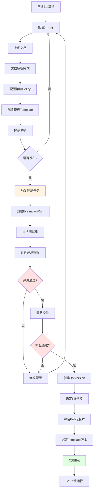
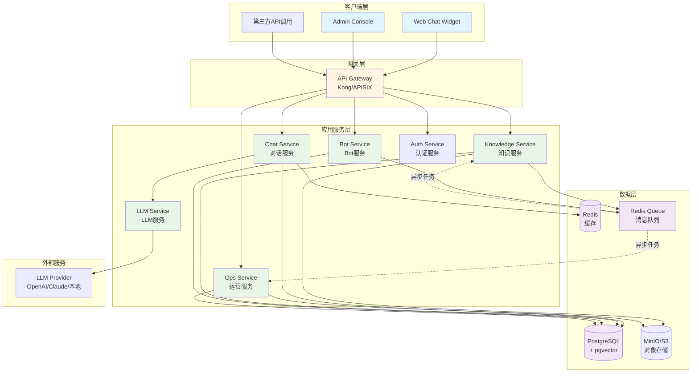

````md
# 行业专家客服平台（Expert Customer Service Platform）需求分析文档（PRD / SRS）

## 文档信息

| 属性 | 值 |
|------|-----|
| **文档版本** | v0.2 |
| **文档状态** | 草案评审中 |
| **创建日期** | 2025-01-15 |
| **最后修订** | 2025-02-02 |
| **作者** | 产品团队 |
| **审阅人** | 技术架构师、业务负责人 |
| **面向受众** | 产品/研发/交付/售前 |
| **目标** | 用"可复制的行业专家客服工厂"模式，为不同行业快速构建可信、可审计、可运营的专业咨询客服能力，并通过多渠道（Web/APP/小程序/API）交付 |
| **核心成功指标** | 在明确边界与可审计条件下，替代至少 40% 的人工重复咨询与标准化报告输出工作量 |

## 版本历史

| 版本 | 日期 | 修订人 | 主要变更内容 |
|------|------|--------|--------------|
| v0.1 | 2025-01-15 | 产品团队 | 初版PRD，定义核心功能与需求 |
| v0.2 | 2025-02-02 | 产品团队 | 补充第9章技术方案、完善KPI定义、补充缺失功能需求、完善API设计、补充安全合规要求 |

## 修订记录

### v0.2 主要修订内容
1. **结构完整性修复**
   - 补全第9章内容（9.1后端架构、9.2向量数据库选型、9.3检索策略、9.4模型选择、9.5消息队列）
   - 新增文档元信息（版本历史表、作者、创建日期、修订记录）

2. **需求明确性提升**
   - 精确化KPI定义（可替代人工工作量判定标准、统计周期）
   - 完善置信度模型（关键点提取方法、阈值建议表）
   - 补充幻觉率目标阈值（<5%）
   - 完善知识分段策略（纯文本、表格、图表处理）

3. **技术方案补充**
   - 向量数据库选型对比与推荐
   - 混合检索融合策略详解
   - Embedding模型选择建议
   - LLM模型选型框架
   - 消息队列机制设计

4. **业务逻辑澄清**
   - Bot发布流程与评测任务关系图
   - 文档更新策略（同名文档处理）
   - 版本回滚规则（KB/Policy/Template联动）

5. **新增功能需求**
   - 多语言支持（MVP后迭代）
   - 流式输出（MVP必须）
   - 全文搜索
   - 相似问题推荐
   - 重新生成功能

6. **非功能需求完善**
   - 并发用户数、数据量级目标
   - 日志保留期（180天）
   - 备份恢复策略
   - 监控告警指标清单

7. **API设计增强**
   - 统一错误码规范
   - 分页机制标准
   - 流式响应格式（SSE）

8. **安全合规补充**
   - 敏感数据脱敏规则
   - 审计日志保留期（3年）

9. **新增附录**
   - 需求优先级（MoSCoW方法）
   - 典型场景描述

---

## 0. 背景与问题定义

### 0.1 背景
专业服务咨询（如：领导力测评解读、管理咨询问答、行业专家答疑）通常存在以下结构性特征：
- 高频重复问题占比高（概念解释、流程说明、常见情境建议）
- 输出形式高度模板化（解读报告、行动建议、训练方案、风险提示）
- 人工工作耗在：检索资料、拼装话术、复述方法论、整理结论
- 质量要求高：需要“可追溯依据”“可控边界”“可解释输出”，不能凭空编造

### 0.2 目标用户痛点
- 企业/机构：希望在成本可控前提下提升咨询响应能力与稳定性
- 专家/教练：希望把时间从重复问答转移到高价值个案
- 终端用户：希望获得稳定、快速、结构化的建议与报告，而不是“闲聊式回答”

### 0.3 产品定位（一句话）
这是一个**多租户**、可配置的**行业专家客服平台**：输入知识库+案例+问题集+结果模板+策略，即可产出一个“可多渠道交付、可引用、可运营、可迭代”的专业客服（含结构化结论/报告输出）。

---

## 1. 产品目标与指标体系（North Star & KPI）

### 1.1 北极星指标

**可替代人工工作量（Automation Coverage）≥ 40%**

#### 精确定义
在指定业务范围内，机器人回答并被用户/运营认定"无需人工介入"的会话占比。

#### 判定标准（必须同时满足）
1. **用户反馈**：用户点击"已解决"或给出正面评价（👍）
2. **时间验证**：在会话结束后3天内，用户未发起转人工或重复咨询同一问题
3. **置信度要求**：机器人回答置信度为HIGH或MEDIUM

#### 统计周期
- **周维度**：每周统计上周数据，用于运营快速响应
- **月维度**：每月统计上月数据，用于整体考核和趋势分析

#### 计算公式示例
```
自动化率 = (机器人独立解决会话数 - 3天内转人工会话数) / 总会话数 × 100%

其中：
- 机器人独立解决会话：action=ANSWER 且 confidence_level≠LOW
- 3天内转人工会话：在原session基础上3天内创建handoff工单
```

### 1.2 核心 KPI（必须可观测）

#### 1.2.1 自动解决率（Auto-Resolved Rate）
- **公式**：机器人独立解决会话数 / 总会话数 × 100%
- **数据来源**：sessions表，过滤action=ANSWER且用户反馈为正面的会话
- **目标值**：MVP ≥30%，生产 ≥50%
- **统计口径**：按日/周/月聚合

#### 1.2.2 转人工率（Handoff Rate）
- **公式**：触发转人工会话数 / 总会话数 × 100%
- **数据来源**：tickets表，统计创建工单的唯一session数
- **目标值**：MVP ≤30%，生产 ≤20%
- **细分指标**：
  - 低置信度触发占比
  - 超边界触发占比
  - 用户主动要求占比

#### 1.2.3 知识命中率（Retrieval Hit Rate）
- **公式**：检索命中（≥阈值）会话数 / 总会话数 × 100%
- **命中判定**：至少返回1个retrieval_score ≥ 0.5的chunk
- **数据来源**：citations表，关联sessions统计
- **目标值**：MVP ≥70%，生产 ≥85%

#### 1.2.4 可引用率（Citable Answer Rate）
- **公式**：回答包含有效引用的会话数 / 总会话数 × 100%
- **有效引用定义**：citations数组非空且至少有1个相关性评分≥3（5分制）
- **数据来源**：messages表 + 人工抽检
- **目标值**：MVP ≥80%，生产 ≥90%

#### 1.2.5 引用正确率（Citation Accuracy）
- **公式**：引用与内容相关的会话数 / 抽检会话数 × 100%
- **抽检比例**：每周随机抽检10%的会话
- **评分标准**：
  | 评分 | 定义 | 示例 |
  |------|------|------|
  | 5分 | 完全相关，内容直接来自引用 | 引用"反馈模型"章节，回答准确描述模型内容 |
  | 3分 | 部分相关，引用提供背景但不直接 | 引用"沟通原则"，回答进行了合理延伸 |
  | 1分 | 不相关，引用与内容无关 | 引用"测评工具"，回答"反馈方法" |
- **目标值**：平均分 ≥4.0分

#### 1.2.6 低置信度率（Low Confidence Rate）
- **公式**：低于阈值触发追问/拒答/转人工的会话数 / 总会话数 × 100%
- **数据来源**：messages表，统计confidence_level=LOW的记录
- **目标值**：≤15%（合理的低置信度表明系统有风险意识）

#### 1.2.7 用户满意度（CSAT / Thumbs Up Rate）
- **公式**：正面评价数 / 总评价数 × 100%
- **正面评价定义**：rating ≥4（5分制）或 thumbs_up=true
- **目标值**：MVP ≥70%，生产 ≥85%

#### 1.2.8 运营纠错闭环效率（Fix-to-Improve Cycle）
- **公式**：从差评/纠错到知识或模板更新上线的平均周期（小时）
- **计算方式**：sum(上线时间 - 纠错时间) / 纠错数量
- **目标值**：MVP ≤72小时（3天），生产 ≤24小时

### 1.3 约束性指标（守住底线）

#### 1.3.1 幻觉率（Hallucination Rate）

**定义**：无引用但给出确定性结论的比例

**确定性结论判定（模态词检测）**
回答中包含以下表达方式之一，且无对应引用支持：
- 肯定断言："确实"、"显然"、"必须"、"一定"
- 具体数据：数字、日期、名称、百分比
- 因果关系："因为...所以..."、"导致"、"造成"
- 推荐建议："建议"、"应该"、"可以"、"需要"

**检测方法**
```python
def detect_conclusive_answer(text, has_citation):
    """
    检测是否为确定性结论
    """
    conclusive_patterns = [
        r'确实|显然|必须|一定|肯定',
        r'\d+[%。，]',  # 数字结尾
        r'建议|应该|需要|可以'
    ]

    has_conclusive = any(re.search(p, text) for p in conclusive_patterns)

    if has_conclusive and not has_citation:
        return True  # 幻觉
    return False
```

**目标阈值**
- MVP：≤10%（允许一定探索）
- 生产：≤5%（严格控）
- 高风险场景（医疗、法律）：≤2%

**监控机制**
- 每日统计幻觉率，超阈值立即告警
- 幻觉案例自动加入待审核队列
- 每周人工抽检100条幻觉案例，优化检测规则

#### 1.3.2 政策违规率
- **定义**：触发敏感/禁止话题的误答率
- **敏感话题**：政治、宗教、歧视性内容、暴力等
- **目标值**：≤0.1%，持续下降趋势

---

## 2. 范围定义（Scope）

### 2.1 产品边界（必须明确）
- 本平台对“专业咨询”的可交付形态负责：**问答 + 结构化结论/报告输出 + 可追溯引用 + 可运营迭代**
- 不承诺替代专家对高风险决策（法律、医疗、心理危机、劳动纠纷等）的判断，必须提供强制转人工/拒答策略

### 2.2 MVP 范围（第一阶段必须完成）
- 多租户（Tenant/Workspace）
- 一个租户可创建多个专家客服（Bot/Agent）
- Web Chat Widget（可嵌入）
- 标准 REST API（供 APP/小程序/第三方调用）
- 知识库上传与索引（文档/网页，先文件优先）
- RAG（检索增强生成）+ 强制引用输出
- 模板化结构输出（JSON/Markdown）
- 转人工（基础形态：表单/工单/通知即可）
- 运营看板（核心 KPI 全量落地）
- 评测回归（离线测试集 + 上线前自动跑）

### 2.3 非 MVP（后续迭代）
- 多渠道原生集成（WhatsApp/LINE/邮件等）
- 语音客服
- 深度系统集成（CRM、HR 系统、工单系统等）
- 高级内容治理（复杂表格、图片知识、大规模 OCR）
- 多模型动态路由与成本自适应优化（可后做）

---

## 3. 角色与权限（RBAC）

### 3.1 角色定义
- 平台超级管理员（Platform Admin）
- 租户管理员（Tenant Admin）
- 知识库运营（Knowledge Operator）
- 模板/策略运营（Policy & Template Operator）
- 人工坐席（Human Agent）
- 终端用户（End User）

### 3.2 权限矩阵（核心）
| 能力 | Platform Admin | Tenant Admin | Knowledge Operator | Policy Operator | Human Agent | End User |
|---|---|---|---|---|---|---|
| 创建/停用租户 | ✅ | ❌ | ❌ | ❌ | ❌ | ❌ |
| 创建/配置 Bot | ✅ | ✅ | ❌ | ✅ | ❌ | ❌ |
| 上传/发布知识库版本 | ✅ | ✅ | ✅ | ❌ | ❌ | ❌ |
| 编辑提示词/策略 | ✅ | ✅ | ❌ | ✅ | ❌ | ❌ |
| 查看会话与导出 | ✅ | ✅ | ✅ | ✅ | ✅ | ❌ |
| 处理转人工工单 | ✅ | ✅ | ❌ | ❌ | ✅ | ❌ |
| 发起聊天/查看结果 | ❌ | ❌ | ❌ | ❌ | ❌ | ✅ |

---

## 4. 业务流程（端到端）

### 4.1 "创建一个行业专家客服"流程

#### 详细步骤
1) 创建租户（Tenant）
2) 创建 Bot
3) 配置 Bot 策略：
   - 可答范围/禁答范围
   - 低置信度处理动作
   - 是否强制引用
   - 是否允许"无检索生成"
4) 上传知识资产：
   - 方法论文档、制度、FAQ、案例库
   - 问题集（测试集）
   - 输出模板（结果结构）
5) 索引构建（解析→分段→embedding→入库）
6) 离线评测（回归测试集）
7) 发布上线（Bot Version）
8) 运行期监控与迭代（差评/纠错→沉淀→新版本）

#### Bot发布流程与评测任务关系



#### 评测任务触发规则

| 触发时机 | 评测类型 | 必须通过才能发布 |
|----------|----------|------------------|
| Bot首次发布 | 完整评测 | 是 |
| KB更新后发布 | 完整评测 | 是 |
| Policy/Template更新 | 回归评测（核心集） | 是 |
| 定期巡检 | 完整评测 | 否（仅告警） |

#### 评测阈值配置

| 指标 | MVP阈值 | 生产阈值 | 说明 |
|------|----------|----------|------|
| 引用正确率 | ≥70% | ≥85% | 引用与内容相关 |
| 答案覆盖度 | ≥2.5分(3分制) | ≥2.8分 | 按rubric评分 |
| 边界合规率 | 100% | 100% | 不能越界 |
| 低置信度拦截率 | ≥60% | ≥80% | 该拦截的要拦截 |
| 幻觉率 | ≤15% | ≤5% | 无引用确定性结论 |

### 4.2 用户咨询流程（运行期）
1) 终端用户发起问题
2) 识别意图（topic / risk / need more info）
3) 检索知识库（混合检索）
4) 置信度评估（检索分数+覆盖率+策略）
5) 输出：
   - 追问（信息不足）
   - 标准回答（带引用）
   - 模板报告（结构化输出）
   - 转人工/拒答（超边界/风险）
6) 用户反馈（👍👎、理由、是否解决）
7) 数据回流到运营（失败聚类、知识缺口）

---

## 5. 功能需求（模块化）

> 说明：每个功能点均给出：描述 / 用户故事 / 验收标准（AC）

### 5.1 多租户与 Bot 管理

#### 5.1.1 租户管理
- 描述：支持创建、停用、限额配置（调用次数、知识库容量、会话保留期）
- AC：
  - 租户数据逻辑隔离（DB 层 + 存储桶路径）
  - 停用后所有 API 返回 403/404（不可继续调用）
  - 可配置会话日志保留天数（默认 180）

#### 5.1.2 Bot（专家客服）管理
- 描述：租户内可创建多个 Bot，每个 Bot 有独立知识库集合与策略版本
- 关键属性：
  - bot_id、name、description、industry_tag
  - bot_version（可发布/回滚）
  - knowledge_base_set（多 KB 组合）
  - policy_set（策略集合）
  - template_set（输出模板集合）
- AC：
  - Bot 的“草稿/已发布”两种状态
  - 发布必须通过：评测任务≥阈值 & 策略校验通过
  - 支持回滚到任意已发布版本

---

### 5.2 知识库系统（KB）

#### 5.2.1 知识导入
- 支持类型（MVP）：PDF、DOCX、Markdown、纯文本
- 导入字段：
  - 文档名、来源、标签、权限范围（仅某 Bot / 多 Bot）
  - 版本号、上传人、上传时间
- AC：
  - 上传完成后进入“处理中”状态，完成解析与索引后变为“可用”
  - 失败可重试，记录失败原因（如：解析失败、超大小等）

#### 5.2.2 文档解析与分段

##### 目标
把长文档变成可检索的 chunk，并保留引用锚点，支持不同类型内容的智能处理。

##### 分段策略详解

**1. 纯文本分段**

**优先级顺序**：
1. 按标题层级分段（H1 > H2 > H3）
2. 按段落边界分段
3. 智能切分（句子边界，避免截断语义）

**智能切分算法**：
```python
def smart_split(text, max_tokens=800, overlap=100):
    """
    智能文本切分
    - max_tokens: 最大token数
    - overlap: 相邻chunk重叠token数
    """
    sentences = split_sentences(text)  # 按句子分割
    chunks = []
    current_chunk = []
    current_length = 0

    for sentence in sentences:
        sentence_tokens = count_tokens(sentence)

        # 如果单句超长，强制切分
        if sentence_tokens > max_tokens:
            if current_chunk:
                chunks.append(' '.join(current_chunk))
                current_chunk = []
                current_length = 0
            chunks.append(sentence[:max_tokens])  # 简化处理
            continue

        # 累加句子
        if current_length + sentence_tokens <= max_tokens:
            current_chunk.append(sentence)
            current_length += sentence_tokens
        else:
            # 保存当前chunk
            chunks.append(' '.join(current_chunk))

            # 创建重叠上下文
            overlap_text = ' '.join(current_chunk[-overlap_tokens:])
            current_chunk = [overlap_text, sentence]
            current_length = count_tokens(overlap_text) + sentence_tokens

    if current_chunk:
        chunks.append(' '.join(current_chunk))

    return chunks
```

**配置参数**：
| 参数 | 推荐值 | 说明 |
|------|--------|------|
| max_tokens | 300-800 | 可配置，根据检索精度需求 |
| overlap | 50-100 | 保持上下文连续性 |
| min_chunk_size | 100 | 避免过短chunk |

**2. 表格处理**

**转换方案**：表格 → JSON/Markdown

**表格转Markdown示例**：
```python
def table_to_markdown(table_data):
    """
    将表格数据转换为Markdown格式
    """
    headers = table_data['headers']
    rows = table_data['rows']

    # 构建Markdown表格
    md_rows = []
    md_rows.append('| ' + ' | '.join(headers) + ' |')
    md_rows.append('|' + '|'.join(['---'] * len(headers)) + '|')

    for row in rows:
        md_rows.append('| ' + ' | '.join(row) + ' |')

    # 添加表格上下文
    caption = table_data.get('caption', '')
    context = f"\n表格：{caption}\n" + '\n'.join(md_rows)

    return context
```

**表格转JSON示例**：
```python
def table_to_json(table_data):
    """
    将表格转换为结构化JSON
    """
    return {
        'type': 'table',
        'headers': table_data['headers'],
        'rows': table_data['rows'],
        'caption': table_data.get('caption', ''),
        'source_page': table_data.get('page_num')
    }
```

**3. 图表处理**

**OCR文字提取**：
- 使用工具：Tesseract、Azure OCR、Google Vision API
- 提取内容：
  - 文字内容（按位置）
  - 坐标信息（bounding box）
  - 图表类型（柱状图、饼图、折线图）

**图表数据结构**：
```json
{
  "type": "chart",
  "chart_type": "bar",
  "text_content": "销售额2023年Q1-Q4数据...",
  "coordinates": {
    "title": {"x": 100, "y": 50, "text": "季度销售额"},
    "x_axis": {"x": 100, "y": 300, "text": "Q1,Q2,Q3,Q4"},
    "y_axis": {"x": 50, "y": 200, "text": "金额"}
  },
  "source_page": 15
}
```

**图表检索策略**：
- 文字内容单独建索引
- 图表类型作为元数据标签
- 支持按图表类型过滤检索

##### 引用信息生成

每个chunk必须包含：
```json
{
  "chunk_id": "doc_123_chunk_45",
  "doc_id": "doc_123",
  "doc_title": "领导力测评解读指南",
  "chapter": "3.2 反馈模型",
  "page_num": 25,
  "text": "......",
  "metadata": {
    "content_type": "text|table|chart",
    "table_caption": "员工能力评级表",
    "chart_type": null
  }
}
```

##### 验收标准（AC）
- 每个 chunk 必须可回溯到原文位置
- 支持"查看 chunk 原文"与"在文档中定位"（至少显示页码/章节）
- 表格chunk可显示为表格格式
- 图表chunk可显示OCR提取的文字

#### 5.2.3 检索（Hybrid Retrieval）
- MVP：向量检索 + 关键词检索（BM25 或等价实现）再融合排序
- 需求：
  - topK 可配置
  - 过滤：标签、时间范围、文档集合、语言
- AC：
  - 单次查询返回：chunk 列表 + 得分 + 引用锚点
  - 支持“命中测试”：输入问题，展示 top chunks 与覆盖率指标

#### 5.2.4 知识版本管理

##### 需求概述
- KB 版本与 Bot 发布版本绑定
- 支持回滚：Bot 可切回旧 KB 版本
- Bot 已发布版本在 KB 更新后不自动变化（必须显式发布新版本）

##### 文档更新策略

**同名文档处理**
- 同ID文档上传时：
  - 创建新版本（version + 1）
  - 保留旧版本数据和向量
  - 旧版本标记为"archived"
- 版本关联：
  - 每个Document有多个DocumentVersion
  - DocumentVersion包含：content, chunk_ids, vector_snapshot_id, created_at

**Bot版本绑定**
- Bot发布时：
  - 创建BotVersion记录
  - 绑定当前KB快照（KB Snapshot）
  - KB Snapshot包含：
    - 所有Document的当前版本ID列表
    - 向量索引快照ID
    - 创建时间戳
- 运行时：
  - Bot使用发布时绑定的KB版本
  - KB更新不影响已发布的Bot（必须发布新版本）

**版本命名规则**
```
v{major}.{minor}.{patch}
例：v1.2.3
- major：重大架构变更（KB重构、模型更换）
- minor：功能更新（新增文档、策略调整）
- patch：bug修复（纠错、小修补）
```

##### 版本回滚规则

**Bot版本回滚**
- 支持回滚到任意已发布版本
- 回滚时自动绑定：
  - 对应版本的KB Snapshot
  - 对应版本的Policy Version
  - 对应版本的Template Version
- 回滚操作记录审计日志

**部分回滚支持**
- 可指定只回滚某个组件：
  - 仅回滚KB版本
  - 仅回滚Policy版本
  - 仅回滚Template版本
- 部分回滚创建新版本号（不覆盖历史）

**回滚限制**
- 不能回滚到已删除的版本
- 回滚需管理员权限
- 生产环境回滚需二次确认

##### 验收标准（AC）
- Bot已发布版本在KB更新后不自动变化
- 支持查看Bot版本绑定的KB详情
- 支持一键回滚到指定版本
- 回滚后Bot立即使用新绑定的版本

---

### 5.3 对话系统（Chat）

#### 5.3.1 Web Chat Widget
- 描述：可嵌入到客户官网/管理后台，支持自定义主题色与欢迎语
- MVP 能力：
  - 用户输入/机器人输出
  - 反馈（👍👎 + 可选理由）
  - 会话 ID 持久化（localStorage/cookie）
- AC：
  - 10 分钟内可完成嵌入（提供 script + bot_key）
  - 跨域安全：仅允许白名单域名加载

#### 5.3.2 会话与上下文管理
- 需求：
  - session（会话）维度存储：用户消息、机器人消息、引用、策略决策
  - 上下文截断策略：避免超长成本失控
- AC：
  - 可配置最大上下文轮数/最大 tokens
  - 超限时自动摘要（summary）并存档

---

### 5.4 “可信回答”与幻觉治理（平台核心）

#### 5.4.1 强制引用模式（Citations Required）
- 需求：
  - 当策略开启时：回答必须至少引用 N 个 chunk，否则进入“追问/拒答/转人工”
  - 对“概念性通识”可允许无引用，但必须显式标注“通用知识（无文档引用）”（是否允许由策略决定）
- AC：
  - 输出中包含引用数组：[{doc_id, chunk_id, title, snippet}]
  - 无引用且给确定性结论时必须被拦截（拒答或转人工）

#### 5.4.2 置信度模型（Rule-based + Score）

##### 需求概述
形成可解释的置信度计算，确保系统对"不确定性"有自我认知能力。

##### 计算要素

**1. 检索质量分数（Retrieval Quality Score）**
```python
def calc_retrieval_score(top_k_chunks):
    """
    计算检索质量分数
    """
    if not top_k_chunks:
        return 0.0

    # 最高分
    score_max = max(c['score'] for c in top_k_chunks)

    # Top3平均分
    score_avg_top3 = sum(c['score'] for c in top_k_chunks[:3]) / min(3, len(top_k_chunks))

    # 综合分数（权重：最高分60%，平均分40%）
    retrieval_score = 0.6 * score_max + 0.4 * score_avg_top3

    return min(retrieval_score, 1.0)  # 归一化到[0,1]
```

**2. 覆盖率（Coverage Score）**

覆盖率 = 有引用支持的关键点数量 / 总关键点数量

**关键点提取方法**

| 方案 | 实现方式 | 优点 | 缺点 | 推荐场景 |
|------|----------|------|------|----------|
| **方案A：LLM提取** | 使用LLM结构化提取关键断言 | 准确、语义理解 | 成本高、延迟 | 生产环境、复杂场景 |
| **方案B：规则提取** | 基于句子分割、关键词匹配 | 快速、成本低 | 准确度较低 | MVP、简单场景 |
| **方案C：混合** | LLM提取+缓存 | 平衡 | 需要缓存策略 | 推荐 |

**方案A实现（推荐）**
```python
def extract_key_points(answer_text):
    """
    使用LLM提取关键点
    """
    prompt = f"""
请从以下回答中提取关键断言或建议（最多5个），以JSON数组返回：

回答：{answer_text}

输出格式：
[
  {{"point": "关键断言1", "type": "assertion|recommendation"}},
  ...
]
"""
    response = llm_client.call(prompt, model="gpt-4o-mini")
    return json.loads(response)
```

**覆盖率计算**
```python
def calc_coverage(key_points, citations):
    """
    计算覆盖率
    """
    if not key_points:
        return 1.0  # 无关键点，默认覆盖

    # 检查每个关键点是否有引用支持
    covered_count = 0
    for point in key_points:
        # 简化版：只要有引用就算覆盖
        # 精确版：检查引用内容是否与关键点语义相关
        if citations and has_relevant_citation(point, citations):
            covered_count += 1

    return covered_count / len(key_points)
```

**3. 风险评分（Risk Score）**
```python
def calc_risk_score(answer_text, policy_topics):
    """
    计算风险评分
    """
    risk_keywords = {
        'legal': ['诉讼', '法院', '起诉', '判决'],
        'medical': ['诊断', '治疗', '药物', '症状'],
        'crisis': ['自杀', '自残', '抑郁', '绝望']
    }

    detected_risks = []
    for topic, keywords in risk_keywords.items():
        if any(kw in answer_text for kw in keywords):
            detected_risks.append(topic)

    # 触发风险主题 -> 扣分
    if detected_risks:
        return -0.3  # 风险扣分

    return 0.0
```

**4. 用户画像完整性（Profile Completeness）**
```python
def calc_profile_completeness(required_fields, user_context):
    """
    计算必需字段完整性
    """
    if not required_fields:
        return 1.0

    filled = sum(1 for field in required_fields if field in user_context)
    return filled / len(required_fields)
```

##### 综合置信度计算

```python
def calc_confidence(retrieval_score, coverage, risk_score, profile_completeness):
    """
    综合计算置信度分数
    """
    # 权重配置
    weights = {
        'retrieval': 0.4,
        'coverage': 0.3,
        'risk': 0.2,
        'profile': 0.1
    }

    # 加权求和
    confidence = (
        weights['retrieval'] * retrieval_score +
        weights['coverage'] * coverage +
        weights['risk'] * max(0, 1 + risk_score) +  # risk_score为负
        weights['profile'] * profile_completeness
    )

    return confidence
```

##### 置信度等级判定

| 场景类型 | HIGH | MEDIUM | LOW |
|----------|------|--------|-----|
| **专业咨询** | ≥0.75 | 0.50-0.75 | <0.50 |
| **通用问答** | ≥0.65 | 0.45-0.65 | <0.45 |
| **高风险场景** | ≥0.85 | 0.70-0.85 | <0.70 |

##### 置信度等级行为映射

| confidence_level | 行为策略 | 示例 |
|------------------|----------|------|
| **HIGH** | 直接回答 | "根据XX理论，您的情况属于..." |
| **MEDIUM** | 回答+限定 | "基于现有资料，可能的建议是...（建议进一步确认）" |
| **LOW** | 追问或转人工 | "为了给您更准确的建议，能否补充..." 或 "建议咨询专家" |

##### 验收标准（AC）
- 每次回答记录：confidence_level + decision_trace
- decision_trace包含：
  - retrieval_score
  - coverage
  - 检测到的风险
  - 各项得分明细
- 管理端可查看置信度分布趋势图

#### 5.4.3 边界策略（Policy）
- 需求：每个 Bot 可配置“可答/禁答/必须转人工”
- 示例：
  - 劳动纠纷/法律意见 → 必须转人工
  - 心理危机/自伤相关 → 必须拒答+引导（如适用）
  - 具体医疗诊断 → 禁答
- AC：
  - 策略变更必须版本化并可回滚
  - 风险命中必须写入审计日志

---

### 5.5 模板化结果输出（Report/Result Template）

#### 5.5.1 模板管理
- 模板类型：
  - quick_answer（简答）
  - structured_report（结构化报告）
  - action_plan（行动计划）
- 模板形式：
  - JSON Schema（强结构）
  - Markdown（可读）
- 变量来源：
  - 用户输入字段（通过追问收集）
  - 检索引用（chunks）
  - 模型推理字段（需标注置信度）
- AC：
  - 每个模板可定义必填字段与追问策略
  - 输出必须符合 JSON Schema（若选择结构化）

#### 5.5.2 追问（Slot Filling）
- 需求：当模板字段缺失时，机器人按策略追问补齐
- AC：
  - 追问最多 N 轮（可配置），超过则转人工/给出部分报告并提示缺项

---

### 5.6 转人工（Human Handoff）

#### 5.6.1 转人工触发条件
- 低置信度
- 超出边界（policy）
- 用户显式要求人工
- 连续多轮未解决（例如 3 次“没用/不对”）
- AC：
  - 转人工时必须携带上下文摘要 + 已检索引用 + 失败原因标签

#### 5.6.2 转人工形态（MVP）
- 简化实现：
  - 生成工单（ticket）
  - 通知（邮件/IM webhook）
  - 人工在后台看到会话并接管（后续增强）
- AC：
  - 工单状态：OPEN / IN_PROGRESS / RESOLVED / CLOSED
  - 支持人工回复回写到原会话

---

### 5.7 运营与分析（Ops & Analytics）

#### 5.7.1 看板指标
- 必须支持按：租户 / Bot / 时间区间过滤
- 图表与列表：
  - 自动解决率
  - 转人工率
  - 命中率
  - 低置信度率
  - TOP 问题（聚类）
  - 知识缺口（无命中问题 Top）
- AC：
  - 指标计算口径统一并可导出 CSV

#### 5.7.2 纠错闭环
- 功能：
  - 对单条会话标注“答案不正确/不完整/无引用/超边界”
  - 一键生成“待补充知识项”或“待新增 Q&A”
  - 形成版本发布任务
- AC：
  - 每条纠错必须关联到：KB 变更或模板/策略变更（至少一个）

---

### 5.8 评测与发布门禁（Eval & Gate）

#### 5.8.1 离线评测（Regression）
- 输入：测试集（question + expected rubric）
- 输出：评测报告
- 指标：
  - 引用正确率（至少有引用且引用相关）
  - 答案覆盖度（按 rubric 打分：0~2）
  - 边界合规率（不越界）
  - 低置信度拦截率（该拦截的是否拦截）
- AC：
  - Bot 发布前必须跑评测并达到阈值
  - 评测报告可下载

#### 5.8.2 在线 A/B（后续）
- 同一租户对比不同策略/模板版本
- 不作为 MVP，但结构预留

---

### 5.9 补充功能需求（MVP后迭代）

#### 5.9.1 多语言支持（MVP后迭代）

**需求描述**
支持多语言知识库和跨语言问答能力。

**功能要求**
- 知识库支持多语言文档
  - 文档上传时可选择语言标签
  - 支持中英日韩等主流语言
- 根据用户问题语言检索对应语料
  - 自动检测用户问题语言
  - 优先检索同语言知识库
  - 可配置跨语言检索（如中文问题检索英文知识）
- 回答使用问题语言
  - LLM使用问题语言生成回答
  - 引用原文保持原语言，提供翻译提示

**技术方案**
- 语言检测：使用langdetect库或LLM判断
- 跨语言检索：使用多语言Embedding模型（如BGE-M3）
- 翻译支持：可选集成翻译API

**优先级**：Should（MVP迭代1）

#### 5.9.2 流式输出（MVP必须）

**需求描述**
/chat接口支持Server-Sent Events (SSE)流式响应，提升用户体验。

**功能要求**
- 首字响应 < 1s
- 完整响应 < 4s
- 支持中断生成
- 显示打字机效果

**SSE事件格式**
```
data: {"type":"token","content":"你"}
data: {"type":"token","content":"好"}
data: {"type":"citation","index":0,"doc_id":"doc_1","title":"反馈模型"}
data: {"type":"done","confidence":"MEDIUM","usage":{"tokens":150}}
```

**客户端示例**
```javascript
const eventSource = new EventSource('/v1/chat/stream?bot_id=xxx&message=你好');

eventSource.onmessage = (event) => {
  const data = JSON.parse(event.data);
  switch(data.type) {
    case 'token':
      appendToChat(data.content);
      break;
    case 'citation':
      showCitation(data);
      break;
    case 'done':
      eventSource.close();
      showConfidence(data.confidence);
      break;
  }
};
```

**优先级**：Must（MVP核心功能）

#### 5.9.3 全文搜索（管理端）

**需求描述**
管理端支持对知识库进行全文搜索，快速定位文档内容。

**功能要求**
- 支持关键词、短语搜索
- 高亮匹配内容
- 按文档/章节/片段层级展示
- 搜索结果可跳转到原文位置

**API设计**
```
POST /admin/knowledge/search
{
  "query": "反馈模型",
  "filters": {
    "doc_ids": ["doc_1", "doc_2"],
    "languages": ["zh"]
  },
  "highlight": true
}
```

**优先级**：Should（MVP迭代1）

#### 5.9.4 相似问题推荐

**需求描述**
用户提问后，推荐3-5个相似问题，帮助用户发现更多相关信息。

**功能要求**
- 基于向量检索相似问题
- 从历史问答中挖掘
- 可配置推荐数量
- 点击推荐问题自动发起查询

**实现方式**
```python
def get_similar_questions(query, top_k=5):
    """
    获取相似问题推荐
    """
    # 从历史问题库检索
    historical_questions = search_historical_questions(query, top_k=top_k*2)

    # 过滤掉当前问题
    similar = [q for q in historical_questions if q['text'] != query][:top_k]

    return similar
```

**UI展示**
```
[用户问题] 如何提高领导力？
[机器人回答] ...

相关问题：
• 如何培养团队领导能力？
• 领导力测评包含哪些维度？
• 新手管理者如何快速上手？
```

**优先级**：Could（后续版本）

#### 5.9.5 重新生成

**需求描述**
用户可点击"重新生成"按钮，保留上下文重新调用LLM生成回答。

**功能要求**
- 保留会话上下文
- 使用不同temperature参数
- 可选更换检索结果
- 显示"正在重新生成..."

**API设计**
```
POST /v1/chat/regenerate
{
  "session_id": "sess_xxx",
  "message_id": "msg_xxx",
  "options": {
    "temperature": 0.8,
    "use_different_retrieval": true
  }
}
```

**优先级**：Should（MVP迭代1）

---

## 6. API 需求（对外统一能力）

### 6.1 鉴权
- API Key（租户级）+ Bot Key（bot 级）
- 支持 JWT（后续）
- AC：
  - API Key 可轮换
  - 每次请求写审计：tenant_id、bot_id、ip、user_agent、cost

### 6.2 核心接口（MVP）

#### 6.2.1 `POST /v1/chat`

发起对话请求。

**请求头**
```
Authorization: Bearer {api_key}
Content-Type: application/json
```

**请求体**
```json
{
  "bot_id": "bot_xxx",
  "session_id": "sess_xxx",      // 可选，缺省创建新会话
  "user_id": "user_xxx",         // 可选，用于用户追踪
  "message": "如何提高领导力？",
  "context": {                    // 可选，用户画像
    "role": "manager",
    "department": "sales"
  },
  "stream": false,                // 是否流式输出
  "options": {
    "temperature": 0.7,
    "max_tokens": 1000
  }
}
```

**响应体（非流式）**
```json
{
  "session_id": "sess_xxx",
  "message_id": "msg_xxx",
  "action": "ANSWER",
  "answer_text": "提高领导力的几个关键建议...",
  "answer_structured": {
    "summary": "领导力提升需要关注三个方面",
    "recommendations": [
      {"title": "建立信任", "priority": "high"},
      {"title": "明确目标", "priority": "medium"}
    ]
  },
  "citations": [
    {
      "doc_id": "doc_1",
      "chunk_id": "c_12",
      "title": "第3章 反馈模型",
      "snippet": "有效的领导力建立在...",
      "relevance_score": 0.92
    }
  ],
  "confidence_level": "MEDIUM",
  "decision_trace": {
    "retrieval_score": 0.85,
    "coverage": 0.8,
    "risk_score": 0
  },
  "usage": {
    "prompt_tokens": 500,
    "completion_tokens": 300,
    "total_tokens": 800
  },
  "created_at": "2025-02-02T10:30:00Z"
}
```

**响应体（流式 SSE）**
```
data: {"type":"token","content":"提"}
data: {"type":"token","content":"高"}
data: {"type":"citation","index":0,"doc_id":"doc_1","title":"第3章 反馈模型"}
data: {"type":"done","confidence":"MEDIUM","usage":{"total_tokens":800}}
```

#### 6.2.2 `POST /v1/feedback`

提交用户反馈。

**请求体**
```json
{
  "session_id": "sess_xxx",
  "message_id": "msg_xxx",
  "rating": 5,                    // 1-5分或thumbs_up(true/false)
  "reason_code": "helpful",       // helpful/not_accurate/irrelevant/other
  "comment": "回答很有帮助"
}
```

**响应体**
```json
{
  "success": true,
  "feedback_id": "fb_xxx"
}
```

#### 6.2.3 `GET /v1/sessions/:id`

获取会话详情。

**响应体**
```json
{
  "session_id": "sess_xxx",
  "bot_id": "bot_xxx",
  "user_id": "user_xxx",
  "status": "active",
  "messages": [
    {
      "role": "user",
      "content": "如何提高领导力？",
      "created_at": "2025-02-02T10:29:50Z"
    },
    {
      "role": "assistant",
      "content": "提高领导力的几个关键建议...",
      "citations": [...],
      "confidence_level": "MEDIUM",
      "created_at": "2025-02-02T10:30:00Z"
    }
  ],
  "created_at": "2025-02-02T10:29:50Z",
  "updated_at": "2025-02-02T10:30:00Z"
}
```

#### 6.2.4 `POST /v1/handoff`

创建转人工工单。

**请求体**
```json
{
  "session_id": "sess_xxx",
  "reason": "低置信度",
  "priority": "normal",           // low/normal/high
  "context": {
    "summary": "用户询问复杂问题",
    "failed_attempts": 2
  }
}
```

**响应体**
```json
{
  "ticket_id": "ticket_xxx",
  "status": "OPEN",
  "estimated_wait_time": 300
}
```

### 6.3 统一响应格式

#### 6.3.1 成功响应
```json
{
  "data": { ... },
  "meta": {
    "request_id": "req_xxx",
    "timestamp": "2025-02-02T10:30:00Z"
  }
}
```

#### 6.3.2 错误响应

**错误码规范**

| 错误码 | HTTP状态 | 说明 | 示例 |
|--------|----------|------|------|
| `VALIDATION_ERROR` | 400 | 请求参数校验失败 | 缺少必填字段 |
| `AUTHENTICATION_FAILED` | 401 | 认证失败 | API Key无效 |
| `PERMISSION_DENIED` | 403 | 权限不足 | 无权访问该Bot |
| `RESOURCE_NOT_FOUND` | 404 | 资源不存在 | Bot不存在 |
| `RATE_LIMIT_EXCEEDED` | 429 | 调用频率超限 | QPS超限 |
| `INTERNAL_ERROR` | 500 | 服务器内部错误 | 系统异常 |
| `SERVICE_UNAVAILABLE` | 503 | 服务暂时不可用 | LLM API故障 |

**错误响应格式**
```json
{
  "error": {
    "code": "RATE_LIMIT_EXCEEDED",
    "message": "API调用频率超限",
    "details": {
      "limit": 10,
      "window": "1m",
      "retry_after": 30
    }
  },
  "meta": {
    "request_id": "req_xxx",
    "timestamp": "2025-02-02T10:30:00Z"
  }
}
```

### 6.4 分页标准

**请求参数**
```
GET /v1/sessions?page=1&page_size=20
```

**响应格式**
```json
{
  "data": [...],
  "pagination": {
    "page": 1,
    "page_size": 20,
    "total": 150,
    "total_pages": 8,
    "has_next": true,
    "has_prev": false
  }
}
```

### 6.5 管理端API（补充）

#### 6.5.1 Bot管理
```
POST   /admin/v1/bots              # 创建Bot
GET    /admin/v1/bots              # 列表（分页）
GET    /admin/v1/bots/:id          # 详情
PUT    /admin/v1/bots/:id          # 更新配置
DELETE /admin/v1/bots/:id          # 删除Bot
POST   /admin/v1/bots/:id/publish  # 发布版本
POST   /admin/v1/bots/:id/rollback # 回滚版本
```

#### 6.5.2 知识库管理
```
POST   /admin/v1/documents         # 上传文档
GET    /admin/v1/documents         # 列表（分页、过滤）
GET    /admin/v1/documents/:id     # 详情
DELETE /admin/v1/documents/:id     # 删除文档
POST   /admin/v1/documents/:id/reparse # 重新解析
GET    /admin/v1/documents/:id/chunks # 查看分段
```

#### 6.5.3 评测管理
```
POST   /admin/v1/evaluations       # 创建评测任务
GET    /admin/v1/evaluations       # 评测列表
GET    /admin/v1/evaluations/:id   # 评测详情
GET    /admin/v1/evaluations/:id/report # 下载报告
```

---

## 7. 数据模型（建议：PostgreSQL + 向量扩展 / 独立向量库）

### 7.1 关键实体

* Tenant
* User（终端用户，可匿名）
* Bot
* BotVersion（发布版本）
* PolicySet / PolicyVersion
* TemplateSet / TemplateVersion
* Document
* DocumentVersion
* Chunk
* Embedding（如果用 pgvector）
* Session
* Message
* Citation（message_id -> chunk_id）
* Ticket（转人工工单）
* EvaluationRun / EvaluationCase / EvaluationResult
* AuditLog

### 7.2 审计日志（强制）

* 所有“知识/策略/模板/发布”操作必须写 AuditLog
* AI 调用必须记：模型名、tokens、cost、耗时、命中信息（至少 top1/topK 分数）

---

## 8. 非功能需求（NFR）

### 8.1 性能

#### 性能目标

| 指标 | MVP目标 | 生产目标 | 测量方法 |
|------|---------|----------|----------|
| **并发用户数** | 100 | 1000+ | 同时活跃session数 |
| **单租户QPS上限** | 10（可配置） | 50（可配置） | API调用频率限制 |
| **首次响应时间(P95)** | < 4s | < 3s | 从请求到首个token |
| **流式首字响应(P95)** | < 1s | < 0.8s | SSE首token到达时间 |
| **完整响应时间(P95)** | < 4s | < 3s | 完整回答生成时间 |
| **文档解析时间** | < 30s/文档 | < 10s/文档 | 10页PDF文档 |
| **检索响应时间** | < 500ms | < 200ms | 向量+BM25检索 |
| **评测执行时间** | < 10min/100case | < 5min/100case | 离线评测任务 |

#### 限流策略
- 租户级：默认10 QPS，可配置
- Bot级：继承租户配置，可独立调整
- 用户级：防止单个用户占用资源
- 突发处理：允许短时间burst，后续限流

### 8.2 可用性

#### 可用性目标
- 核心服务可用性：MVP 99%，生产 99.5%
- 数据库可用性：99.9%（主从/集群）
- LLM服务：考虑API故障时的降级策略

#### 容灾策略
- 数据库：主从复制，自动故障转移
- 缓存：Redis Sentinel/Cluster
- 服务：多实例部署，负载均衡
- 降级：LLM故障时返回缓存回答或转人工

### 8.3 安全

#### 数据安全
- 租户隔离：数据层强隔离（tenant_id 强约束，所有查询必须带tenant_id）
- 存储加密：静态加密（数据库加密、存储桶加密）
- 传输加密：强制HTTPS/TLS 1.3
- 敏感数据脱敏：详见8.6节

#### 应用安全
- Prompt Injection 防护：
  - 系统提示不可覆盖
  - 引用内容标记来源，不可伪造
  - 危险指令过滤
- API安全：
  - API Key轮换机制
  - 请求签名验证（可选）
  - 防重放攻击（nonce + timestamp）
- 权限控制：
  - RBAC权限模型
  - 最小权限原则
  - 审计日志记录所有敏感操作

### 8.4 成本控制

#### 缓存策略
- Embedding缓存：
  - 相同文本的embedding结果缓存7天
  - LRU淘汰策略
- 检索结果缓存：
  - 相同query的检索结果缓存5分钟
  - 仅缓存高分结果
- LLM响应缓存（可选）：
  - 完全相同的问答可缓存
  - 需谨慎使用，注意时效性

#### 上下文控制
- 最大上下文轮数：默认10轮
- 最大tokens：可配置，默认4000
- 超限处理：自动摘要并存档

#### 模型档位支持（后续）
- 基础档：GPT-4o-mini（低成本）
- 标准档：GPT-4o（平衡）
- 高级档：Claude 3.5 Sonnet（高质量）

### 8.5 运维要求

#### 日志管理
- 日志保留期：180天（可配置）
- 日志级别：
  - ERROR：立即告警
  - WARN：每日汇总
  - INFO：正常运营
  - DEBUG：问题排查
- 日志格式：JSON结构化，包含trace_id

#### 备份恢复
- 备份频率：每日全量备份
- 备份保留：30天
- 恢复目标：
  - RTO（恢复时间目标）：4小时
  - RPO（恢复点目标）：1天
- 备份验证：每周恢复测试

#### 监控告警

**核心监控指标**

| 类别 | 指标 | 告警阈值 | 级别 |
|------|------|----------|------|
| **系统** | CPU使用率 | >80% | Warning |
| **系统** | 内存使用率 | >85% | Warning |
| **系统** | 磁盘使用率 | >80% | Warning |
| **API** | 响应时间P95 | >5s | Warning |
| **API** | 错误率 | >5% | Critical |
| **API** | QPS | 下降>50% | Critical |
| **业务** | 幻觉率 | >10% | Warning |
| **业务** | 转人工率 | >50% | Warning |
| **LLM** | API失败率 | >10% | Warning |
| **数据库** | 连接池使用率 | >90% | Critical |

**告警通道**
- Critical：立即电话+短信+邮件
- Warning：工作时间内邮件+IM
- Info：每日汇总报告

### 8.6 安全合规

#### 敏感数据脱敏

**PII检测（可选开关）**
- 文档上传前可启用PII检测
- 检测类型：
  - 身份证号、护照号
  - 手机号、邮箱
  - 银行卡号
  - 地址信息
- 检测方式：
  - 正则表达式匹配
  - NER模型识别
  - LLM辅助判断

**脱敏规则**
| 数据类型 | 脱敏方式 | 示例 |
|----------|----------|------|
| 手机号 | 保留前3后4 | 138****1234 |
| 邮箱 | 保留首字符和域名 | e***@example.com |
| 身份证 | 保留前6后4 | 110101********1234 |
| 姓名 | 保留姓氏 | 王** |

#### 审计日志

**记录范围**
- 所有"知识/策略/模板/发布"操作
- 所有API调用（tenant_id、bot_id、ip、user_agent、cost）
- 所有AI调用（模型名、tokens、cost、耗时、命中信息）
- 所有转人工操作
- 所有数据导出操作

**审计日志保留**
- 保留期：3年（合规要求）
- 访问权限：仅平台审计员
- 不可篡改：写入后只读
- 定期归档：到冷存储

**审计日志内容示例**
```json
{
  "audit_id": "audit_xxx",
  "timestamp": "2025-02-02T10:30:00Z",
  "actor": {
    "user_id": "user_123",
    "role": "Tenant Admin",
    "ip": "1.2.3.4"
  },
  "action": "bot.publish",
  "target": {
    "tenant_id": "tenant_1",
    "bot_id": "bot_1",
    "version": "v1.2.0"
  },
  "details": {
    "evaluation_run_id": "eval_456",
    "kb_snapshot_id": "kb_snap_789"
  },
  "result": "success"
}
```

---

## 9. 技术方案建议（可落地架构）

### 9.1 推荐架构（模块解耦）

#### 9.1.1 前端架构

**Admin Console（管理控制台）**
- 技术栈推荐：Next.js 14+ / React 18+ / TypeScript
- 理由：
  - SSR/SSG支持，首屏加载快
  - 内置路由和API路由
  - 丰富的UI组件库（shadcn/ui、Ant Design）
- 核心模块：
  - 租户管理模块
  - Bot配置管理模块
  - 知识库管理模块
  - 对话监控模块
  - 数据分析看板模块
  - 评测管理模块

**Web Chat Widget（对话组件）**
- 技术栈推荐：React + TypeScript（独立npm包）
- 交付形式：
  - npm包：`@expert-cs/chat-widget`
  - UMD脚本：可通过CDN直接引入
  - iframe嵌入（备选方案）
- 核心能力：
  - 自定义主题色、欢迎语
  - 会话持久化（localStorage/cookie）
  - 流式输出支持
  - 多语言支持
  - 移动端适配

#### 9.1.2 后端架构

**后端框架选择**
- 推荐选项：
  1. **Node.js + NestJS**（推荐）
     - 理由：TypeScript原生支持、模块化架构、依赖注入、装饰器语法
     - 适合场景：快速开发、团队熟悉JS生态
  2. **Java + Spring Boot**
     - 理由：企业级稳定性、丰富生态、强类型
     - 适合场景：大型企业、已有Java技术栈

**API Gateway（API网关）**
- 推荐方案：
  - 云原生：Kong / APISIX
  - 轻量级：Nginx + Lua
  - 云服务：AWS API Gateway / Azure API Management
- 核心功能：
  - 统一鉴权（API Key验证、JWT解析）
  - 限流熔断（租户级、Bot级）
  - 请求路由
  - 日志记录
  - 跨域处理

#### 9.1.3 服务拆分（微服务架构）

**核心服务（Core Service）**
- 职责：租户管理、用户管理、权限控制
- API：
  - `POST /tenants` - 创建租户
  - `GET /tenants/:id` - 获取租户信息
  - `POST /users` - 创建用户
  - `POST /auth/login` - 用户登录

**知识服务（Knowledge Service）**
- 职责：文档上传、解析、分段、向量化、检索
- API：
  - `POST /documents` - 上传文档
  - `POST /documents/:id/parse` - 触发解析
  - `GET /documents/:id/status` - 查询解析状态
  - `POST /search` - 执行检索
- 异步任务：
  - 文档解析队列
  - Embedding生成队列

**对话服务（Chat Service）**
- 职责：会话管理、消息处理、置信度评估
- API：
  - `POST /chat` - 发送消息
  - `GET /sessions/:id` - 获取会话
  - `POST /feedback` - 提交反馈
  - `POST /handoff` - 转人工

**LLM服务（LLM Service）**
- 职责：LLM调用、Prompt管理、流式输出
- 支持模型：
  - OpenAI GPT系列
  - Anthropic Claude系列
  - 本地模型（通过vLLM/llama.cpp）
- API：
  - `POST /generate` - 生成回答
  - `POST /generate/stream` - 流式生成

**运营服务（Ops Service）**
- 职责：数据分析、评测、纠错闭环
- API：
  - `GET /analytics/dashboard` - 获取看板数据
  - `POST /evaluations` - 创建评测任务
  - `POST /corrections` - 提交纠错

**Bot服务（Bot Service）**
- 职责：Bot配置、策略管理、版本控制
- API：
  - `POST /bots` - 创建Bot
  - `PUT /bots/:id` - 更新Bot配置
  - `POST /bots/:id/publish` - 发布Bot版本
  - `POST /bots/:id/rollback` - 回滚版本

#### 9.1.4 数据存储方案

**关系型数据库**
- 推荐：PostgreSQL 15+
- 理由：
  - 支持JSONB（灵活存储策略、模板）
  - pgvector扩展（向量检索）
  - 强ACID保证
  - 丰富的索引类型
- 核心表：
  - tenants, users, bots, bot_versions
  - documents, chunks, embeddings
  - sessions, messages, citations
  - policies, templates, tickets
  - evaluations, audit_logs

**向量数据库**
- MVP阶段：PostgreSQL + pgvector
- 生产阶段：独立向量库（Milvus/Qdrant）
- 详见9.2节

**缓存层**
- 推荐：Redis 7+
- 用途：
  - 会话状态缓存
  - Embedding缓存
  - 检索结果缓存
  - 限流计数器
  - 分布式锁

**对象存储**
- 推荐：MinIO（自部署）或 S3（云服务）
- 用途：
  - 原始文档存储
  - 解析结果存储
  - 评测报告存储
  - 导出文件存储

**消息队列**
- 详见9.5节

#### 9.1.5 架构图



### 9.2 向量数据库选型

#### 9.2.1 方案对比

| 特性 | pgvector | Milvus | Qdrant | Pinecone |
|------|----------|--------|--------|----------|
| **部署复杂度** | 低（PostgreSQL扩展） | 中（独立集群） | 低（Docker单机） | 无（托管服务） |
| **运维成本** | 低（复用DB运维） | 高（独立维护） | 中 | 高（云服务成本） |
| **性能** | 中（百万级向量） | 高（亿级向量） | 高（亿级向量） | 高（亿级向量） |
| **功能完整性** | 基础 | 丰富 | 丰富 | 丰富 |
| **扩展性** | 垂直扩展 | 水平扩展 | 水平扩展 | 自动扩展 |
| **成本** | 低 | 中（基础设施） | 中（基础设施） | 高（按使用付费） |
| **数据一致性** | 强（ACID） | 最终一致 | 最终一致 | 最终一致 |
| **适合场景** | MVP、中小规模 | 大规模生产 | 大规模生产 | 快速原型、免运维 |

#### 9.2.2 推荐方案

**MVP阶段：PostgreSQL + pgvector**
- 理由：
  - 降低运维复杂度（单一数据库）
  - 满足MVP规模（10万-100万文档片段）
  - 支持SQL查询（与其他表联查）
  - 开发调试便捷
- 配置建议：
  - 索引类型：HNSW（高性能近似搜索）
  - 维度：取决于Embedding模型（如768/1536）
  - M参数：16（HNSW图连接数）
  - ef_construction：64（构建时搜索深度）

**生产阶段：Milvus / Qdrant**
- 切换时机：
  - 向量数量超过500万
  - QPS要求超过100
  - 需要更高级的索引和过滤功能
- 推荐选择：**Qdrant**
  - 理由：
    - 部署简单（单机Docker即可）
    - 性能优秀（Rust实现）
    - 支持过滤查询、多向量、Payload索引
    - RESTful API友好
    - 开源免费（自部署）

#### 9.2.3 向量检索配置建议

**HNSW索引参数**
```sql
-- 创建索引
CREATE INDEX ON embeddings USING hnsw (vector vector_cosine_ops)
WITH (M = 16, ef_construction = 64);

-- 查询时设置ef_search
SET hnsw.ef_search = 100;  -- 搜索精度与性能权衡
```

**距离度量选择**
- Cosine Similarity（推荐）：文本语义相似度
- Euclidean Distance：数值型向量
- Dot Product：归一化向量等价于Cosine

### 9.3 检索策略详解

#### 9.3.1 混合检索架构

混合检索 = 向量检索（语义） + 关键词检索（字面） + 融合排序

```
用户查询
    │
    ├─→ 向量检索
    │       ↓
    │   TopK语义相关chunks
    │
    ├─→ 关键词检索（BM25）
    │       ↓
    │   TopK字面匹配chunks
    │
    └─→ 融合排序
            ↓
        最终TopK结果
```

#### 9.3.2 融合算法

**方案1：RRF（Reciprocal Rank Fusion，推荐）**
```python
def rrf_merge(vector_results, bm25_results, k=60):
    """
    RRF融合算法
    k: 常数，默认60，用于平滑排序影响
    """
    scores = {}

    # 向量检索结果（排名从1开始）
    for rank, doc in enumerate(vector_results, 1):
        doc_id = doc['id']
        scores[doc_id] = scores.get(doc_id, 0) + 1/(k + rank)

    # BM25检索结果
    for rank, doc in enumerate(bm25_results, 1):
        doc_id = doc['id']
        scores[doc_id] = scores.get(doc_id, 0) + 1/(k + rank)

    # 按融合分数排序
    return sorted(scores.items(), key=lambda x: x[1], reverse=True)
```

**方案2：加权融合**
```python
def weighted_merge(vector_results, bm25_results, alpha=0.5):
    """
    加权融合
    alpha: 向量检索权重，(1-alpha)为BM25权重
    """
    scores = {}

    # 归一化向量分数到[0,1]
    vec_max = max(r['score'] for r in vector_results) if vector_results else 1
    for doc in vector_results:
        doc_id = doc['id']
        normalized_score = doc['score'] / vec_max
        scores[doc_id] = scores.get(doc_id, 0) + alpha * normalized_score

    # 归一化BM25分数
    bm25_max = max(r['score'] for r in bm25_results) if bm25_results else 1
    for doc in bm25_results:
        doc_id = doc['id']
        normalized_score = doc['score'] / bm25_max
        scores[doc_id] = scores.get(doc_id, 0) + (1 - alpha) * normalized_score

    return sorted(scores.items(), key=lambda x: x[1], reverse=True)
```

**方案3：拼接后重排**
- 流程：先分别检索，合并去重，再用Rerank模型重排
- 优点：灵活，可使用更强的重排模型
- 缺点：增加一次LLM调用，延迟增加

#### 9.3.3 Rerank方案

**推荐Rerank模型**
| 模型 | 性能 | 速度 | 推荐场景 |
|------|------|------|----------|
| **Cohere Rerank API** | 高 | 快 | 有API预算 |
| **BGE-Reranker** | 高 | 中 | 本地部署 |
| **Cross-Encoder** | 中 | 快 | 轻量级 |

**Rerank流程**
```python
def rerank(query, candidates, top_k=10):
    """
    使用Cross-Encoder重排
    """
    # 准备query-doc对
    pairs = [(query, doc['text']) for doc in candidates]

    # 批量打分
    scores = reranker_model.predict(pairs)

    # 重新排序并返回TopK
    reranked = sorted(zip(candidates, scores),
                      key=lambda x: x[1], reverse=True)
    return [doc for doc, _ in reranked[:top_k]]
```

#### 9.3.4 TopK选择策略

**动态TopK**
```python
def dynamic_topk(retrieval_results, min_k=3, max_k=10):
    """
    根据检索质量动态调整TopK
    """
    # 计算分数衰减
    if len(retrieval_results) < 2:
        return retrieval_results[:min_k]

    top_score = retrieval_results[0]['score']
    threshold_score = top_score * 0.7  # 阈值：最高分的70%

    # 返回分数高于阈值的结果
    qualified = [r for r in retrieval_results if r['score'] >= threshold_score]

    k = min(max(len(qualified), min_k), max_k)
    return retrieval_results[:k]
```

**推荐配置**
| 场景 | TopK范围 | Rerank |
|------|----------|--------|
| 简单问答 | 3-5 | 否 |
| 专业咨询 | 5-10 | 是 |
| 报告生成 | 10-20 | 是 |

### 9.4 模型选择

#### 9.4.1 Embedding模型推荐

| 模型 | 维度 | 语言 | 性能 | 速度 | 推荐部署 |
|------|------|------|------|------|----------|
| **text-embedding-3-small** | 1536 | 多语言 | 高 | 快 | API |
| **text-embedding-3-large** | 3072 | 多语言 | 很高 | 快 | API |
| **BGE-M3** | 1024 | 多语言 | 高 | 中 | 本地 |
| **bge-large-zh-v1.5** | 1024 | 中文 | 高 | 中 | 本地 |
| **e5-large-v2** | 1024 | 多语言 | 高 | 中 | 本地 |

**推荐方案**
- MVP阶段：**OpenAI text-embedding-3-small**
  - 理由：性能好、稳定、多语言支持、无需部署
- 生产阶段：**BGE-M3**（本地部署）
  - 理由：降低成本、数据隐私、支持多语言、长文本（8192 token）

#### 9.4.2 LLM模型推荐

| 模型 | 上下文 | 推理能力 | 成本 | 速度 | 推荐场景 |
|------|--------|----------|------|------|----------|
| **GPT-4o** | 128K | 很高 | 高 | 快 | 复杂推理、报告生成 |
| **GPT-4o-mini** | 128K | 高 | 低 | 很快 | MVP、一般问答 |
| **Claude 3.5 Sonnet** | 200K | 很高 | 中 | 快 | 长文档、复杂推理 |
| **Claude 3 Haiku** | 200K | 中 | 很低 | 很快 | 简单问答、高并发 |
| **Qwen2.5-72B** | 32K | 高 | 很低 | 中 | 本地部署、中文优化 |

**推荐方案**
- 云端API（MVP推荐）：
  - 主模型：GPT-4o-mini（性价比）
  - 备用：Claude 3.5 Sonnet（复杂场景）
- 本地部署（数据敏感场景）：
  - 推荐使用vLLM部署Qwen2.5-72B-Instruct
  - 硬件要求：4x A100 (80GB) 或 8x A40 (48GB)

#### 9.4.3 多模型支持方案

**模型路由策略**
```python
def route_model(query, complexity, budget):
    """
    根据查询复杂度和预算选择模型
    """
    # 简单问答 -> 小模型
    if complexity == 'low':
        return 'gpt-4o-mini'

    # 复杂推理 -> 大模型
    if complexity == 'high':
        return 'gpt-4o'

    # 预算限制 -> 本地模型
    if budget == 'low':
        return 'qwen2.5-72b'

    return 'gpt-4o-mini'  # 默认
```

**模型配置管理**
```json
{
  "models": {
    "default": "gpt-4o-mini",
    "fallback": "gpt-4o",
    "local": "qwen2.5-72b",
    "routing_rules": [
      {
        "condition": "complexity == 'high'",
        "model": "gpt-4o"
      },
      {
        "condition": "topic == 'legal'",
        "model": "claude-3.5-sonnet"
      }
    ]
  }
}
```

### 9.5 异步任务与消息队列

#### 9.5.1 消息队列选型

| 方案 | 优点 | 缺点 | 推荐场景 |
|------|------|------|----------|
| **Redis Queue** | 轻量、部署简单、持久化 | 功能相对简单 | MVP、中小规模 |
| **RabbitMQ** | 功能丰富、可靠性高 | 运维复杂 | 企业级、高可靠 |
| **Kafka** | 高吞吐、可回溯 | 运维复杂、重量级 | 大规模日志、事件流 |
| **Cloud Tasks** | 托管服务、自动扩展 | 云厂商锁定 | GCP环境 |

**推荐方案：Redis Queue（基于BullMQ）**
- 理由：
  - 轻量级，与Redis缓存共用
  - 支持任务优先级、延迟任务、重试
  - 有Web UI监控面板（Bull Board）
  - Node.js生态友好

#### 9.5.2 文档解析异步流程

```
文档上传
    ↓
创建Document记录（状态：pending）
    ↓
加入解析队列
    ↓
[Worker 1] 文档格式解析
    ├─ PDF → 提取文本、表格、图片
    ├─ DOCX → 提取文本、表格
    └─ Markdown → 提取文本、代码块
    ↓
[Worker 2] 文本分段
    ├─ 按标题层级分段
    ├─ 智能切分（段落/句子）
    └─ 保留引用锚点
    ↓
[Worker 3] Embedding生成
    └─ 批量调用Embedding API
    ↓
[Worker 4] 向量入库
    └─ 批量插入向量数据库
    ↓
更新Document状态（状态：completed）
```

**任务配置**
```javascript
// 文档解析队列配置
const documentQueue = new Queue('document-parse', {
  connection: redis,
  defaultJobOptions: {
    attempts: 3,           // 失败重试3次
    backoff: 'exponential', // 指数退避
    removeOnComplete: {
      age: 3600,           // 1小时后删除完成任务
      count: 1000          // 最多保留1000条
    },
    removeOnFail: {
      age: 24 * 3600       // 1天后删除失败任务
    }
  }
});
```

#### 9.5.3 评测任务异步执行

```
触发评测
    ↓
创建EvaluationRun记录
    ↓
生成评测任务列表
    ├─ 并行执行多个测试集
    └─ 每个测试集包含多个case
    ↓
加入评测队列
    ↓
[Worker] 执行单个评测Case
    ├─ 调用/chat接口
    ├─ 收集回答、引用、置信度
    ├─ 计算指标（引用正确率、覆盖度等）
    └─ 保存EvaluationResult
    ↓
[Aggregator] 汇总评测结果
    ├─ 计算平均指标
    ├─ 生成评测报告
    └─ 判断是否通过阈值
    ↓
更新EvaluationRun状态
```

**评测队列优先级**
```javascript
// 评测队列配置
const evalQueue = new Queue('evaluation', {
  connection: redis,
  defaultJobOptions: {
    priority: 5,  // 中等优先级
    attempts: 2,
    timeout: 60000  // 单个case超时1分钟
  }
});

// 发布前评测（高优先级）
async function runPrePublishEval(botId) {
  await evalQueue.add(
    'pre-publish-eval',
    { botId, testSetId: 'default' },
    { priority: 10 }  // 高优先级
  );
}
```

#### 9.5.4 安全风险

* 风险：Prompt Injection（用户诱导忽略规则、泄露系统提示、编造引用）
	+ 验证：准备 20 条注入攻击样本，要求：系统提示不可覆盖、引用 ID 不可伪造、策略命中要写入 trace

### 9.6 技术选型决策表

| 组件类别 | 候选方案 | 推荐方案 | 推荐理由 | 备选方案 |
|----------|----------|----------|----------|----------|
| **后端框架** | Node.js + NestJS<br>Java + Spring Boot<br>Python + FastAPI | **Node.js + NestJS** | TypeScript原生支持、模块化架构、开发效率高、生态丰富 | Spring Boot（Java团队）<br>Fast API（Python团队） |
| **前端框架** | Next.js<br>React<br>Vue | **Next.js 14+** | SSR/SSG支持、首屏快、内置API路由、生态成熟 | React 18（传统SPA）<br>Vue 3（团队熟悉） |
| **向量数据库** | pgvector<br>Milvus<br>Qdrant<br>Pinecone | **pgvector (MVP) → Qdrant (生产)** | MVP降低复杂度；生产独立向量库提升性能 | Milvus（大规模）<br>Pinecone（免运维） |
| **关系数据库** | PostgreSQL<br>MySQL<br>MongoDB | **PostgreSQL 15+** | JSONB灵活存储、pgvector扩展、ACID保证、丰富索引 | MySQL（已有技术栈）<br>MongoDB（文档优先） |
| **缓存** | Redis<br>Memcached | **Redis 7+** | 数据结构丰富、支持队列、持久化、可做消息队列 | Memcached（简单缓存） |
| **消息队列** | Redis Queue<br>RabbitMQ<br>Kafka | **Redis Queue (BullMQ)** | 轻量级、与缓存共用、支持优先级、Web UI监控 | RabbitMQ（高可靠）<br>Kafka（大数据量） |
| **对象存储** | MinIO<br>AWS S3<br>Azure Blob | **MinIO (自部署)** | 开源、S3兼容、可自托管、成本可控 | S3（AWS环境）<br>Azure Blob（Azure环境） |
| **LLM API** | OpenAI<br>Anthropic<br>本地部署 | **OpenAI GPT-4o-mini (主) + Claude 3.5 (备)** | 性价比高、稳定性好、多语言；Claude复杂场景备用 | 本地Qwen2.5（数据敏感） |
| **Embedding** | OpenAI<br>Cohere<br>本地模型 | **OpenAI text-embedding-3-small (MVP) → BGE-M3 (生产)** | 多语言、性能好；生产本地部署降低成本 | BGE-large-zh（中文优化）<br>Cohere（多语言） |
| **Rerank模型** | Cohere Rerank<br>BGE-Reranker<br>Cross-Encoder | **BGE-Reranker (本地)** | 性能好、可自部署、降低API调用成本 | Cohere API（快速集成） |
| **API网关** | Kong<br>Nginx<br>APISIX | **Kong** | 功能丰富、插件生态、云原生友好 | Nginx（轻量级）<br>APISIX（国产） |
| **监控** | Prometheus + Grafana<br>DataDog<br>云服务 | **Prometheus + Grafana** | 开源、灵活、生态成熟、无厂商锁定 | DataDog（SaaS）<br>云服务（快速） |
| **日志** | ELK Stack<br>Loki<br>云服务 | **Loki + Grafana** | 轻量级、与监控一体化、成本低 | ELK（功能丰富）<br>云服务（免运维） |
| **部署** | Docker<br>Kubernetes<br>云服务 | **Docker Compose (MVP) → K8s (生产)** | MVP简单快速；生产自动扩展、高可用 | 云服务（托管） |

### 9.7 架构演进路线图

```
MVP阶段 (0-3个月)
├── 单体应用部署
├── PostgreSQL + pgvector
├── Redis缓存+队列
├── OpenAI API
└── Docker Compose

       ↓

生产阶段 (3-6个月)
├── 微服务拆分
├── Qdrant向量库
├── Redis Cluster
├── 本地LLM部署
├── Kubernetes部署
└── Prometheus + Grafana监控

       ↓

规模化阶段 (6个月+)
├── 多区域部署
├── CDN加速
├── 读写分离
├── 缓存分层
└── 自动扩缩容
```

### 9.8 技术检讨结论模板（每次迭代必填）

> 用于 Milestone 节奏的“评审/复盘记录”。每次迭代至少填一次，确保 vibe coding 不跑偏。

* 本次迭代变更：
	+ KB（新增/替换文档数、是否重建向量）
	+ 提示词/策略（policy_set 变更点）
	+ 模板（schema 变更点）
* 指标变化（与上次对比）：
	+ 引用可用率、引用相关性抽检、越界违规率、低置信度率、P95、单问成本
* Top 失败类型（按数量）：
	+ 无命中 / 命中但不相关 / 引用缺失 / 追问失败 / 越界误判
* 纠正动作：
	+ 补知识 / 调分段 / 加 rerank / 改 policy / 改模板 / 改提示词
* 是否允许发布：
	+ 是/否（若否，阻塞原因与下一步）

---

## 附录A：需求优先级（MoSCoW方法）

### Must Have（MVP必须完成）

| 功能模块 | 优先级 | 理由 |
|----------|--------|------|
| 多租户与Bot管理 | P0 | 核心基础能力 |
| 知识库上传与解析 | P0 | 知识来源 |
| 混合检索（向量+BM25） | P0 | 检索质量保障 |
| RAG+强制引用 | P0 | 可信回答核心 |
| 流式输出（SSE） | P0 | 用户体验基础 |
| 转人工（工单） | P0 | 风险兜底 |
| 运营看板（核心KPI） | P0 | 运营闭环 |
| 离线评测与发布门禁 | P0 | 质量保障 |

### Should Have（MVP迭代1）

| 功能模块 | 优先级 | 理由 |
|----------|--------|------|
| 重新生成功能 | P1 | 提升用户体验 |
| 相似问题推荐 | P1 | 发现更多需求 |
| 全文搜索（管理端） | P1 | 提升运营效率 |
| 多语言支持 | P1 | 国际化需求 |
| A/B测试 | P2 | 策略优化 |
| 高级内容治理 | P2 | 复杂文档处理 |

### Could Have（后续版本）

| 功能模块 | 优先级 | 理由 |
|----------|--------|------|
| 多渠道原生集成 | P3 | 扩展触达渠道 |
| 语音客服 | P3 | 特殊场景需求 |
| 深度系统集成 | P3 | 企业级需求 |
| 多模型动态路由 | P3 | 成本优化 |
| 实时协作编辑 | P3 | 团队协作 |

### Won't Have（明确不做）

| 功能 | 不做理由 | 替代方案 |
|------|----------|----------|
| 完全自主决策 | 风险太高，需保留人工审核 | 转人工机制 |
| 实时数据接入 | 复杂度高，需求不明确 | 定期更新知识库 |
| 社交媒体监听 | 超出产品边界 | API对接第三方 |

---

## 附录B：典型场景描述

### 场景1：领导力测评解读流程

**用户背景**
- HR经理，刚收到员工领导力测评报告
- 需要给员工提供反馈和改进建议

**用户操作**
1. 上传测评报告（PDF）
2. 输入问题："某员工领导力得分较低，如何给出反馈？"

**系统处理**
```
1. 检索"领导力测评解读指南"
2. 定位到"反馈模型"章节
3. 提取关键点：
   - 肯定优点
   - 指出差距
   - 提供改进建议
4. 生成结构化反馈模板
```

**系统输出**
```
根据《领导力测评解读指南》第3章，建议采用SBI反馈模型：

1. Situation（情境）：描述具体场景
2. Behavior（行为）：指出观察到的行为
3. Impact（影响）：说明行为的影响

针对该员工的得分情况，建议：
- 肯定其在团队协作方面的优势（得分85分）
- 关注决策能力的提升空间（得分62分）
- 提供具体的改进训练建议

引用：第3.2节 反馈模型，第5章 能力提升训练方案
```

**用户反馈**
- 点赞👍
- 标记"已解决"

---

### 场景2：管理咨询问答流程

**用户背景**
- 企业中层管理者
- 遇到团队管理实际问题

**用户操作**
1. 输入问题："团队士气低落，怎么办？"

**系统处理**
```
1. 检索"团队管理"相关知识
2. 识别为低置信度（检索分数0.4，覆盖度低）
3. 触发追问机制
```

**系统追问**
```
为了给您更准确的建议，能否补充以下信息：
1. 团队规模？
2. 士气低落的表现是什么？
3. 最近是否有重大变化？
```

**用户补充信息**
```
团队20人，最近项目失败，团队成员缺乏信心
```

**系统重新处理**
```
1. 重新检索，检索分数提升到0.75
2. 检索到"危机后的团队重建"章节
3. 生成结构化建议
```

**系统输出**
```
针对项目失败后的士气恢复，建议采取以下措施：

短期行动（1-2周）：
1. 组织团队复盘会议（参考：第6章 复盘方法）
2. 诚实沟通失败原因，明确责任边界
3. 识别团队中的"关键意见领袖"

中期措施（1-3个月）：
1. 设置小型速赢项目，重建信心
2. 提供一对一辅导
3. 定期庆祝小胜利

引用：第8.3节 危机管理，第9章 士气提升策略

置信度：MEDIUM（基于通用管理理论，建议结合实际情况调整）
```

---

### 场景3：转人工与工单处理

**用户背景**
- 用户询问劳动纠纷相关问题

**用户操作**
1. 输入问题："员工要求2N赔偿，公司拒绝，如何处理？"

**系统处理**
```
1. 检索到相关劳动法知识
2. 识别命中"劳动纠纷"风险策略
3. 置信度评估：LOW
4. 策略决策：强制转人工
```

**系统输出**
```
抱歉，您的问题涉及劳动纠纷，需要专业法律意见。

已为您创建工单，专家将在24小时内回复。

工单号：TK20250202001
预计响应时间：2小时内

您也可以直接拨打法律咨询热线：400-xxx-xxxx
```

**人工处理**
1. 人工坐席收到工单
2. 查看会话历史和系统检索结果
3. 给出专业建议
4. 回复同步到用户会话

---

## 附录C：术语表

| 术语 | 英文 | 定义 |
|------|------|------|
| RAG | Retrieval-Augmented Generation | 检索增强生成，结合检索和生成的AI回答方式 |
| Embedding | - | 文本向量化表示，用于语义相似度计算 |
| BM25 | - | 经典的关键词检索算法 |
| Rerank | - | 对检索结果重新排序，提升相关性 |
| RRF | Reciprocal Rank Fusion | 倒数排名融合，混合检索融合算法 |
| SSE | Server-Sent Events | 服务器推送事件，用于流式输出 |
| KB | Knowledge Base | 知识库 |
| Bot | - | 对话机器人 |
| PII | Personally Identifiable Information | 个人身份信息 |
| AC | Acceptance Criteria | 验收标准 |
| KPI | Key Performance Indicator | 关键绩效指标 |
| NFR | Non-Functional Requirement | 非功能需求 |
| MVP | Minimum Viable Product | 最小可行产品 |

---

## 附录D：参考文献与标准

- [1] OpenAI API Documentation
- [2] Anthropic Claude API Reference
- [3] PostgreSQL pgvector Extension Documentation
- [4] Redis Best Practices
- [5] OAuth 2.0 Authorization Framework
- [6] ISO/IEC 27001 Information Security Management
- [7] GDPR Compliance Guidelines
- [8] OWASP Top 10 Web Application Security Risks

---

**文档结束**
